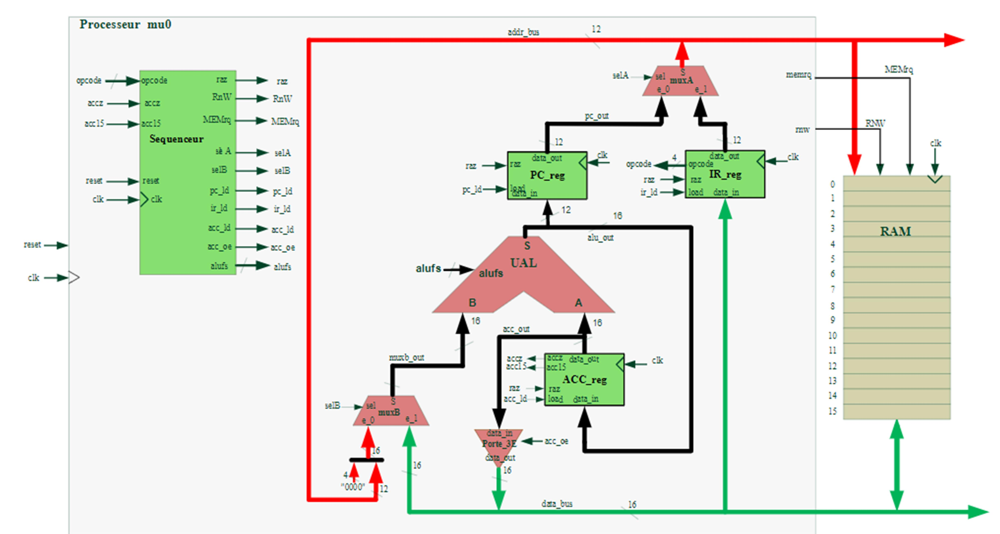

# SoC Architecture on FPGA using VHDL



## Overview

This repository contains the design and implementation of a basic System-on-Chip (SoC) / educational microcontroller architecture on FPGA using **VHDL**.

The project follows five progressive parts:

1. **PART1 — Combinational circuits**
   - Tri-state buffer
   - Multiplexer
   - Arithmetic Logic Unit (ALU)

2. **PART2 — Sequential circuits**
   - Accumulator register `ACC`
   - Program Counter `PC`
   - Instruction Register `IR`

3. **PART3 — Control unit**
   - Sequencer / FSM
   - Instruction decoding

4. **PART4 — Microcontroller and memory integration**
   - Datapath integration
   - RAM memory
   - Top-level project

5. **PART5 — Test, validation and FPGA implementation**
   - Testbench
   - Simulation
   - FPGA workflow

---

## Architecture

The microcontroller contains:

- 16-bit data bus
- 12-bit address bus
- 4096 addressable memory words
- Accumulator-based datapath
- RAM interface
- Basic instruction sequencer

Main hardware blocks:

- `P3E`: Tri-state buffer
- `Mux`: Generic multiplexer
- `ALU`: Arithmetic Logic Unit
- `Acc`: Accumulator register
- `PC`: Program Counter
- `IR`: Instruction Register
- `sequenceurSOC`: Control Unit / FSM
- `mem`: RAM memory
- `mu`: Microcontroller datapath
- `Projet`: Microcontroller + RAM top-level

---

## Instruction Set

| Opcode | Mnemonic | Description |
| ------ | -------- | ----------- |
| `0000` | `LDA` | Load accumulator from memory |
| `0001` | `STO` | Store accumulator to memory |
| `0010` | `ADD` | Add memory value to accumulator |
| `0011` | `SUB` | Subtract memory value from accumulator |
| `0100` | `JMP` | Unconditional jump |
| `0101` | `JGE` | Jump if accumulator is positive or zero |
| `0110` | `JNE` | Jump if accumulator is not zero |
| `0111` | `STOP` | Stop processor |
| `1000` | `AND` | Logical AND |
| `1001` | `OR` | Logical OR |
| `1010` | `XOR` | Logical XOR |

Instruction format:

```text
15          12 11                         0
+-------------+----------------------------+
|   opcode    |        address/immediate    |
+-------------+----------------------------+
```

---

## ALU Operations

| `alufs` | Operation | Description |
| ------- | --------- | ----------- |
| `0000` | `B` | Transfer B |
| `0001` | `B + 1` | Increment B |
| `0010` | `A + B` | Addition |
| `0011` | `A - B` | Subtraction |
| `1000` | `A AND B` | Logic AND |
| `1001` | `A OR B` | Logic OR |
| `1010` | `A XOR B` | Logic XOR |

---

## Repository Structure

```text
SoC-VHDL-Architecture/
├── README.md
├── LICENSE
├── .gitignore
├── CONTRIBUTING.md
├── CHANGELOG.md
├── docs/
├── src/
├── sim/
├── fpga/
├── programs/
├── scripts/
└── .github/workflows/
```

---

## Simulation with GHDL

Run all testbenches:

```bash
chmod +x scripts/run_all.sh
./scripts/run_all.sh
```

Run the full project testbench manually:

```bash
ghdl -a --std=08 src/tristate/p3e.vhd
ghdl -a --std=08 src/mux/mux.vhd
ghdl -a --std=08 src/alu/alu.vhd
ghdl -a --std=08 src/registers/acc.vhd
ghdl -a --std=08 src/registers/pc.vhd
ghdl -a --std=08 src/registers/ir.vhd
ghdl -a --std=08 src/sequencer/sequenceurSOC.vhd
ghdl -a --std=08 src/memory/mem.vhd
ghdl -a --std=08 src/top/mu.vhd
ghdl -a --std=08 src/top/projet.vhd
ghdl -a --std=08 sim/testbenches/bench_projet.vhd
ghdl -e --std=08 bench_projet
ghdl -r --std=08 bench_projet --vcd=sim/waveforms/bench_projet.vcd --stop-time=2us
gtkwave sim/waveforms/bench_projet.vcd
```

---

## FPGA Workflow

1. Create a Vivado or Quartus project.
2. Add all VHDL files from `src/`.
3. Set `Projet` as the top-level entity.
4. Add board constraint file from `fpga/constraints/`.
5. Run synthesis.
6. Run implementation / place-and-route.
7. Generate bitstream.
8. Program the FPGA board.

---

## Future Improvements

- Add flags register: Carry, Overflow, Negative, Zero
- Add UART peripheral
- Add SPI/I2C controllers
- Add interrupt support
- Add stack pointer
- Add assembler script
- Add pipeline architecture
- Build a small RISC-V inspired CPU

---

## Author

**Lamouchi Med Bayrem**  
Embedded Systems | FPGA | AI | Robotics | IoT

---

## License

This project is released under the MIT License.
